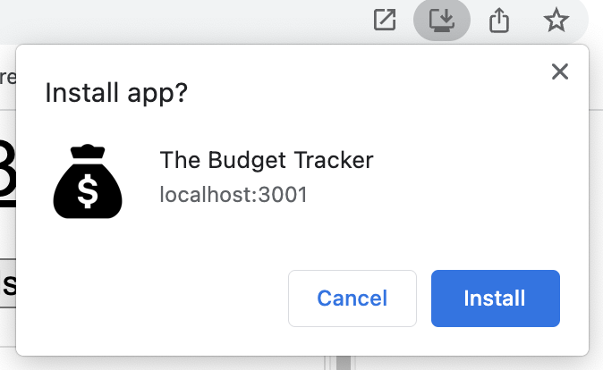
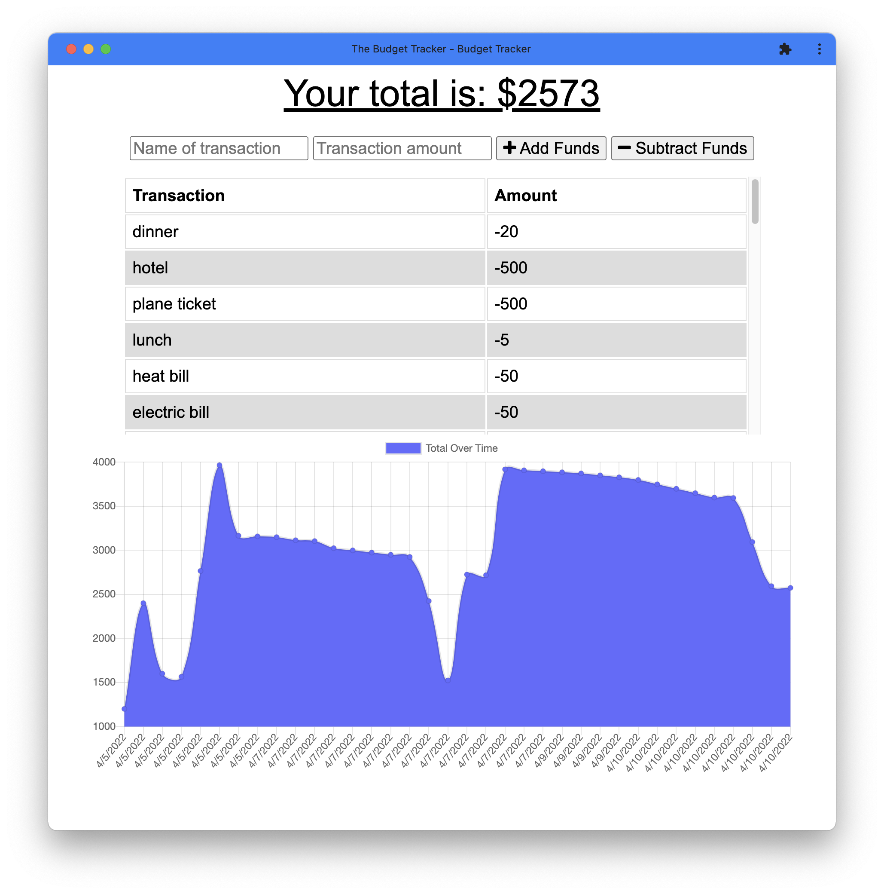

# Budget Tracker PWA

## Description
Progessive Web Applications (PWA) ensure web apps work without internet connection by using service workers that cache the assets and API responses. PWA's also can be installed on a device (such as a mobile phone) and look and work just like a mobile app.  

This repository contains the code for a Budget Tracker PWA. This app gives users a fast and easy way to keep track of their money while also having offline functionality. This way users can still enter transactions even when their lose connection to the network. 

## Deployed Website
This application is deployed on Heroku.  
<link goes here>

## Technologies Used
* PWA
* IndexDB
* Service Workers
* MongoDB
* Mongoose

## Usage
How a user can download the app to their device: 
 
  
 
The app once it is download to the user's device: 
 

## Questions
Feel free to reach out to me for any questions or comments.  
Link to my GitHub: github.com/lindseymiller2567